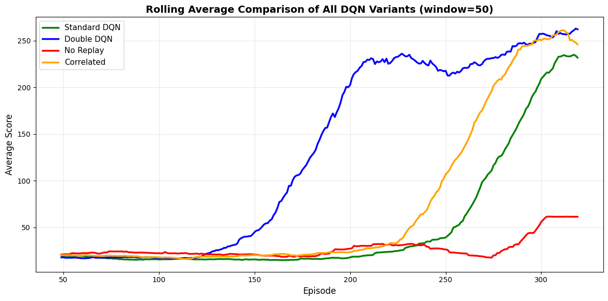

# Comparative Study of DQN Variants on CartPole-v1

This project implements and compares several **Deep Q-Network (DQN)** variants to solve the classic **CartPole-v1** reinforcement learning environment from [OpenAI Gymnasium](https://gymnasium.farama.org/).

The goal is to analyze how different algorithmic strategies—such as Double Q-learning, Experience Replay, and Correlated Sampling—affect learning stability, convergence speed, and overall performance.

---

## 📘 Overview

The project explores four main variants of Deep Q-Learning:

| Variant                          | Description                                                                                |
| -------------------------------- | ------------------------------------------------------------------------------------------ |
| **Standard DQN**                 | Baseline implementation using experience replay and target network updates.                |
| **Double DQN**                   | Reduces overestimation bias by decoupling action selection from target value estimation.   |
| **DQN without Replay**           | Learns from sequential experiences without replay memory (less stable).                    |
| **DQN with Correlated Sampling** | Samples consecutive experiences from replay memory to visualize the impact of correlation. |

---

## ⚙️ Implementation Details

The project was implemented in **Python** using **PyTorch** and **Gymnasium**.

**Key components:**

- `QNetwork` — neural network approximating the Q-function.
- `ReplayMemory` — experience buffer to decorrelate transitions.
- `DQAgent` and derived agents — implement different learning strategies.
- `dqn_train()` — training loop handling epsilon-greedy exploration and updates.

Training was run for **320 episodes per agent**, with identical hyperparameters for fair comparison.

---

## 📊 Results and Analysis

The following visualizations summarize training progress and performance comparisons.

### 🎯 Individual Performance Comparisons


Each subplot shows the training curve for one DQN variant, with raw scores and a rolling average over 50 episodes.  
We can see that **Standard DQN** and **Double DQN** converge faster and more stably compared to the others.

---

### 📈 Rolling Average Comparison of All Variants



This figure directly compares all variants on a single plot.

- The **Standard DQN** (green) shows the most stable convergence.
- **Double DQN** (blue) slightly underperforms but with reduced variance.
- **No Replay** and **Correlated Sampling** (red/orange) suffer from instability and slower learning.

---

### 🧮 Summary Statistics

| Variant      | Final 100-Episode Average | Max Score | Stability      |
| ------------ | ------------------------- | --------- | -------------- |
| Standard DQN | ~165                      | High      | 🟧 Less Stable |
| Double DQN   | ~243                      | High      | 🟩 Moderate    |
| No Replay    | ~40                       | Low       | 🔴 Unstable    |
| Correlated   | ~210                      | Medium    | ✅ Stable      |

---

## 🚀 How to Run

### 1. Clone the repository

```bash
git clone https://github.com/tarikbenaouda/Comparative-Study-of-DQN-Variants-on-CartPole-v1.git
cd Comparative-Study-of-DQN-Variants-on-CartPole-v1
```
